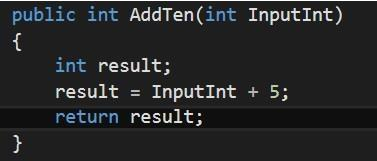
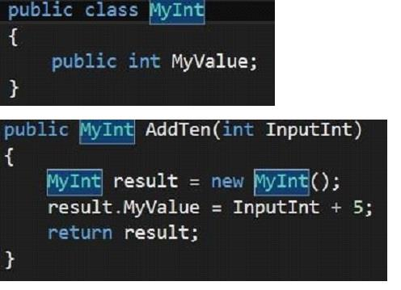
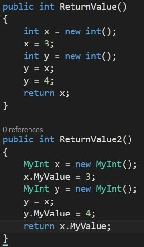
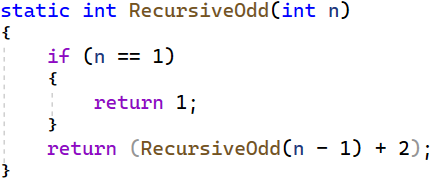
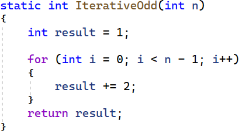

**Övning** **4** **-** **Minneshantering**

*OBS* *-* *Resultatet* *av* *övningen* *skall* *visas* *för* *lärare*
*och* *godkännas* *innan* *den* *kan* *anses* *vara* *genomförd.*

**Instruktioner:**

**Samtlig** **kod** **för** **övningarna** **skrivs** **i** **det**
**medföljande** **projektet** **”Ovning4_SkalProj”** **på** **klassens**
**GitHub.** **I** **koden** **finns** **även** **kompletterande**
**instruktioner.**

Frågorna som ställs besvaras som kommentarer i koden. Övning 1-4 är
prioriterade. 5-6 är extra om tid finns.

**Teori** **och** **fakta**

Mycket av minneshanteringen inom .NET skötersig självt, men som
programmerare är det bra att ha en viss insikt om hur det går till under
huven när koden körs. Minnet är då uppdelat i en ***stack***
(trave/stapel, senare benämnt: ***stacken***) och en ***heap***(en
trädstruktur, senare benämnd: ***heapen***), men innan vi går in på vad
dessa två delar hanterar, ska vi ta en titt på hur de fungerar.

Stacken, som namnet föreslår, kan ses som en mängd boxar staplade på
varandra.Där vi använder innehållet i den översta boxen och för att
komma åt den undre måste den ovanstående boxen först lyftas av. För att
exemplifiera detta ytterligare kan stacken ses som skolådor i en
skobutik, där du för att komma åt de nedre lådorna måste flytta bort de
övre.

Heapen däremot, är inte lika enkel att förklara i ord. *Heapen* är en
form av struktur där allt är tillgängligt på en gång med enkel åtkomst.
För att även verklighetsförankra denna datastruktur går det att likna
*heapen* med en hög med ren tvätt som ligger utspridd över en säng: allt
går att nå fort och enkelt bara vi vet vad vi vill ha.

*Stacken* har koll på vilka *anrop* och *metoder* som körs, när metoden
är körd kastas den från *stacken* och nästa körs. *Stacken* är alltså
självunderhållande och behöver ingen hjälp med minnet. *Heapen* däremot
som håller stor del av informationen (men inte har någon koll på
exekveringsordning) behöver oroa sig för ***Garbage*** ***Collection***.
Alltså: skokartongerna sköter sig själv medan tvätthögen måsterensas på
smutsig tvätt ibland.

Vad skiljer då det som lagras i stacken och heapen? För att förstå det
ska vi lära oss mer om de fyra typerna i C#, ***Value*** ***Types***,
***Reference*** ***Types***, ***Pointers*** och ***Instructions***.

*Value* *Types* är typer från *System.ValueType* som listas nedan:

||
||
||

> 1/7

*Reference* *Types* är typer som ärver från *System.Object* (eller är
*System.Object.object*) *•* *class*

> *•* *interface* *•* *object*
>
> *•* *delegate* *•* *string*

Nästa typ är pointers. Dessa är inget som vi behöver tänka på utan
behandlas av ***Common*** ***Language*** ***Runtime*** ***(CLR)**.* En
*pointer* skiljer sig från *reference* *types*, i det avseendet att när
något är av en *referencetype*, så kommer vi åt det via en *pointer*. En
*pointer* är alltså något som tar plats i minnet och pekar på antingen
en annan plats i minnet eller *null*.

*Instructions* kommer inte gås igenom i denna övning, men ni ska veta
att det finns.

Hur vet vi då vad som lagras vart?

En *reference* *type* lagras
alltid på *heapen*. Medan *Value* *types*, lagras där de deklareras.
Alltså kan *value* *types* lagras både på *stacken* eller *heapen*.
Följande exempel kan ge mer klarhet:

Denna metod (*se* *bild* *ovan*) kommer allt att köras på stacken.Detta
då alla *value* *types* deklareras i en metod, som läggs på stacken.

>  style="width:2.87944in;height:2.09028in" />I exemplet till vänster
> kommer dock *MyValue* att ligga på *heapen*, då den deklarerats i en
> klass som är en *reference* *type.*
>
> Den huvudsakliga skillnaden mellan dessa två, är att all information i
> det första exemplet kommer att raderas närdet är färdigkört då stacken
> rensar sig själv, medan *MyInt*:en från exempel två kommer fortsätta
> ta upp plats på *heapen* även efter *stacken* är klar med den. Den
> kommer ligga där tills *GC* *(Garbage* *Collector)* tar hand om den.

Frågor:

> 1\. Hur fungerar *stacken* och *heapen*? Förklara gärna med exempel
> eller skiss på dess grundläggande funktion
>
> 2/7

> 2\. Vad är *Value* *Types* respektive *Reference* *Types* och vad
> skiljer dem åt?
>
> 3\. Följande metoder (*se* *bild* *nedan*) genererar olika svar.Den
> första returnerar 3, den andra returnerar 4, varför?
>
> 3/7

**Datastrukturer** **och** **minneseffektivitet**

För att underlätta minneshantering och skriva minnessnålare
funktionalitet är det bra att ha ett hum om olika datastrukturer och när
de kan användas.Detta ska ni nu öva på, dels på papper och dels genom
kod. Kom ihåg att kommentera all kod.

<u>Som nämnt tidigare genomförs dessa övningar idet bifogade
skalprojektet och frågorna</u> <u>besvaras på relevant plats med
kommentarer i koden.</u>

*Övning* *1:* *ExamineList()*

En lista är en *abstrakt* *datastruktur* som kan implementeras på flera
olika sätt. Till skillnad från ***arrayer***har *listor* inte en
förutbestämd storlek utan storleken ökar i takt med att antalet element
i listan ökar. ***Listklassen*** har dock en underliggande *array* som
ni nu ska undersöka. För att se storleken på listans underliggande array
används *Capacity-metoden* i *Listklassen*.

> 1\. Skriv klart implementationen av *ExamineList-metoden* så att
> undersökningen blir genomförbar.
>
> 2\. När ökar listans kapacitet? (Alltså den underliggande arrayens
> storlek) 3. Med hur mycket ökar kapaciteten?
>
> 4\. Varför ökar inte listans kapacitet i samma takt som element läggs
> till? 5. Minskar kapaciteten när element tas bort ur listan?
>
> 6\. När är det då fördelaktigt att använda en egendefinierad *array*
> istället för en lista?

*Övning* *2:* *ExamineQueue()*

Datastrukturen ***kö*** (implementerad i ***Queue-klassen***) fungerar
enligt **Först** **In** **Först** **Ut** **(*FIFO*)** principen. Alltså
att det element som läggs till först kommer vara det som tas bort först.

> 1\. Simulera följande kö på papper:
>
> a\. ICA öppnar och kön till kassan är tom b. Kalle ställer sig i kön
>
> c\. Greta ställer sig i kön
>
> d\. Kalle blir expedierad och lämnar kön e. Stina ställer sig i kön
>
> f\. Greta blir expedierad och lämnar kön g. Olle ställer sig i kön
>
> h\. …
>
> 2\. Implementera metoden *ExamineQueue*. Metoden ska simulera hur en
> *kö* fungerar genom att tillåta användaren att ställa element ikön
> (***enqueue***) och ta bort element ur kön (***dequeue***). Använd
> *Queue-klassen* till hjälp för att implementera metoden. Simulera
> sedan ICA-kön med hjälp av ditt program.

*Övning* *3:* *ExamineStack()*

Stackar påminner om köer, men en stor skillnad är att stackar använder
sig av **Först** **In** **Sist** **Ut** **(*FILO***) principen. Alltså
gäller att det element som stoppas in först (***push***) är det som
kommer tas bort sist (***pop***).

> 4/7
>
> 1\. Simulera ännu en gång ICA-kön på papper. Denna gång med en
> *stack*. Varför är det inte så smart att använda en *stack* i det här
> fallet?
>
> 2\. Implementera en ReverseText-metod som läser in en sträng från
> användaren och med hjälp av en stack vänder ordning på teckenföljden
> för att sedan skriva ut den omvända strängen till användaren.

*Övning* *4:* *CheckParenthesis()*

Ni bör nu ha tillräckliga kunskaper om ovannämnda datastrukturer för att
lösa följande problem.

Vi säger att en sträng är *välformad* om alla parenteser som öppnas även
stängs korrekt. Att en parentes öppnas och stängs korrekt dikteras av
följanderegler:

> • ), }, \] får enbart förekomma efter respektive (, {, \[
>
> • Varje parentes som öppnas måste stängas dvs ”(” följs av ”)”

Exempelvis är (\[{}\]({})) välformad men inte ({)}. Vidare kan en sträng
innehålla andra tecken, t ex är ”List\<int\> lista = new
List\<int\>(){2, 3, 4};” välformad. Vi bryr oss alltså endast om
parenteser!

> 1\. Skapa med hjälp av er nya kunskap funktionalitet för att
> kontrollera en välformad sträng på papper.Du ska använda dig av någon
> eller några av de datastrukturer vi precis gått igenom. Vilken
> datastruktur använder du?
>
> 2\. Implementera funktionaliteten i metoden *CheckParentheses*.Låt
> programmet läsa in en *sträng* från användaren och returnera ett svar
> som reflekterar huruvida strängen är välformad eller ej.
>
> 5/7

**Rekursion** **och** **Iteration** **(Extra** **om** **tid** **finns)**

För att ta reda på mer om hur viktigt det är att tänka på hur mycket som
läggs på *stacken* finns även detta kapitel om ***rekursion*** och
***iteration***. För en som inte är insatt kan *rekursion* och
*iteration* se väldigt lika ut, detta för att en *rekursion* kan ses som
en *iteration* av sig själv.

Rekursion är en funktion som anropar sig själv, ned till ett basfall,
och därefter gör alla beräkningar upp till det anrop som initierade
rekursionen. Nedan följer ett exempel på hur en rekursiv metod kan
beräkna det n:te udda talet.

Det metoden gör är att se efter om *n* är *1*, om så returerar den det
första udda talet *1*. Annars så anropar den sig själv för ett mindre
*n* och lägger till två.

*Övning* *5:* *Rekursion*

> 1\. Illustrera förloppen för RecursiveOdd(1), RecursiveOdd(3) och
> RecursiveOdd(5) på papper för att förstå den rekursiva loopen.
>
> 2\. Skriv en *RecursiveEven(int* *n)* metod som rekursivt beräknar det
> *n*:te <u>jämna</u> talet. 3. Implementera en rekursiv funktion för
> att beräkna tal i *fibonaccisekvensen:* *(f(n)* *=*
>
> *f(n-1)* *+* *f(n-2))*
>
> 6/7

> *Övning* *6:* *Iteration*
>
> Nu när ni är bekanta med rekursion är det dags att kolla på iteration.
> Iteration är en funktion som upprepar samma sak till dess att målet är
> uppnått. Så en iterativ funktion för att göra föregående beräkning om
> det n:te udda talet skulle se ut:
>
> Denna metod börjar från 1 och adderar2 till dess att resultat blir det
> *n*:te udda talet.
>
> 1\. Illustrera på papperförloppen för *IterativeOdd(1)*,
> *IterativeOdd(3)* och *IterativeOdd(5)* för att förstå iterationen.
>
> 2\. Skapa en *IterativeEven(int* *n)* funktion för att iterativt
> beräkna det *n*:te jämna talet. 3. Implementera en iterativ version av
> *fibonacciberäknaren*.
>
> Fråga:

Utgå ifrån era nyvunna kunskaper om iteration, rekursion och
minneshantering. Vilken av ovanstående funktionerär mest minnesvänlig
och varför?

> 7/7
